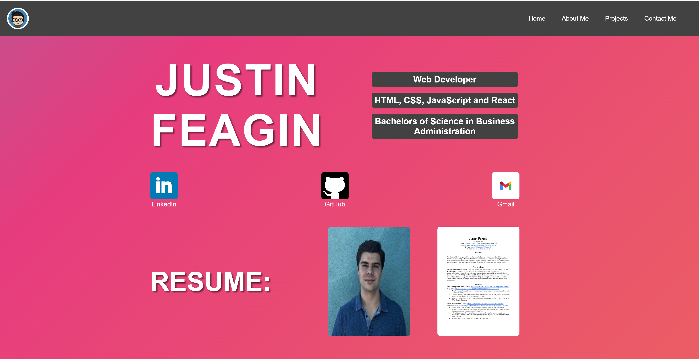

# Justin-Feagin-Portfolio

## Description

This web application serves as a means for me to upload and showcase my completed projects. As of right now, it is showcasing 5 different projects, although this number will be expanded in the future. It also serves as a way for potential employers to be introduced to me, to learn about me, and to reach out in order to contact me.

Throughout this project, I learned the ins and outs of making a web application through react. There were so many issues I ran into along the way, especially in CSS. But working through these issues in order to achieve a finalized product is what really gave me a deeper knowledge on this language.

## Instalation

This entire project was made using vite. In order to get this repository up and running, Make sure you run an npm install in the root directory, then everything should be good to go.

## Usage

The final product looks like this:

If you click on any of the 4 items in the navigation bar, the website will automatically direct you to that portion of the web app. You can also click on all the images and icons in order to be taken to their corresponding links. The website has also been optimized in order to resize certain elements based of the size of the viewport.

Here is a link to the completed web application: 

## Credit

This application was built with assistance from my peers and instructors within the UCSD Extended Studies Coding Bootcamp.